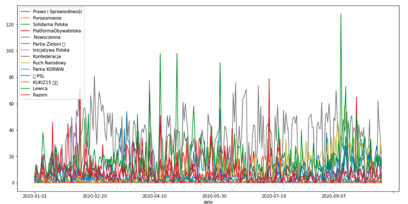

# sma-twitter-polish-parties-participation

Assignment for the Social Media Analysis course at WUST (Wroclaw University of Science and Technology).

### Project steps
1. Data: Scrapping polish parties tweets using twint library. The following parties were considered (grouped by their coalition):
```python
[pisorgpl, Porozumienie__, SolidarnaPL], 
[platforma_org, Nowoczesna, Zieloni, inicjatywaPL], 
[KONFEDERACJA_, RuchNarodowy, Partia_KORWiN], 
[nowePSL, KUKIZ15],
[__Lewica, partiarazem]
```
2. Analysis & Visualization: Analysing aquired tweets
* number of tweets in time
* popularity of tweets in time
* distribution of activity in the scope of a day (on an hourly basis) and week (on a daily basis)
* results of the parties included in the coalition comparison
3. Sentiment analysis: answers the following questions:
* Does ruling parties posts sentiment differ from opposition parties? Which are most polarized?
* Does parties posts sentiment differ from people's comments? Which party is mostly loved and which is mostly hated?
* Does parites forming a coallition speak with the same voice?

### Scope: knowledge and skils
* understanding Twitter data
* Twitter data acquisition
* basic textual analysis
* time series visualization 
* venv
* Jupiter ipython notebooks
* Python:
	* data organization: pandas
	* visualization: matplotlib
	* NLP: polyglot 
	* scrapping: twint

### Outcome
Analysis available in notebooks.

Example of visualization (more readable are also available 😀)
